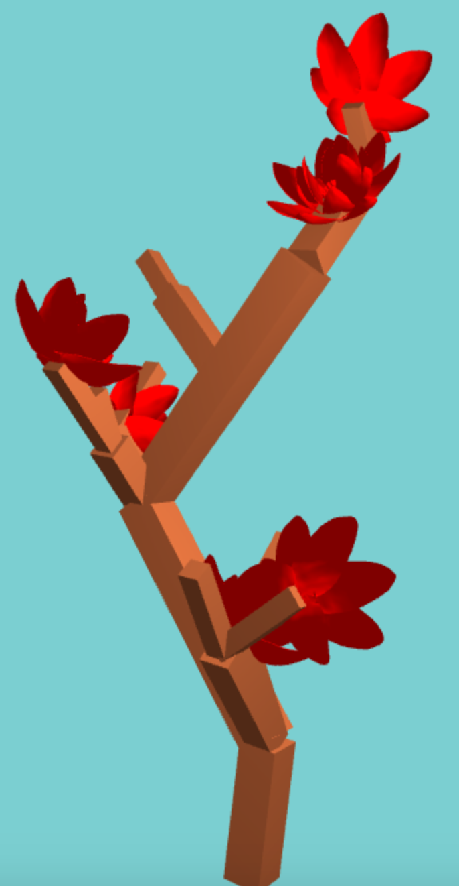

# L-System Tree

## Grammar Rules
Here are the rules that define the L-system behavior:  
* [ and ] are save and load turtle state, respectively
* \+ is rotate the turtle state (random axis of +/- x/y)
* D extends a branch in the turtle direction
* F draws a flower at the turtle orientation
* B decomposes into D\[+B\] (a recursive branch)
* S decomposes into D\[+BF\]\[+S\]+ (a splitting branch)

## User Parameters
Color1 and color2 are simply colors of branches and flowers respectively.  
Grammar is the set of rules to be expanded. This happens iter number of times.  
If there is an S or B after expansion, they will be drawn as a branch just like D.  
Variation affects how much randomness is applied to rotation angle and branch length.  

